# Home Credit Data Quality System

---

## Project Summary & Key Limitations

This project provides a robust data quality monitoring system for the Home Credit dataset using Apache Iceberg on HDFS, with daily simulation via PySpark scripts and comprehensive DQ checks. **We successfully used DQOps for manual data profiling and OpenRefine for manual QA, but full automation was limited due to integration complexities with Iceberg-on-HDFS and resource constraints (16GB+ RAM, high CPU, heavy SSD I/O).**

---

## Why This Approach?

- **What was tried:** I attempted direct integration of DQOps (via Spark Thrift Server, JDBC, and local Parquet) and OpenRefine (via Parquet, CSV, and HDFS connectors) for automated profiling and cleaning.
- **What worked:** DQOps manual profiling via Parquet export and OpenRefine manual QA via CSV export provided valuable insights and data cleaning capabilities.
- **What failed:** Direct automation failed due to catalog/metastore issues, resource exhaustion, lack of native Parquet/HDFS support in OpenRefine, and DQOps Cloud API key/trial period limitations ("DQOps Cloud Pairing API Key is invalid. Your trial period has expired. or your FREE account was not granted free access to the Data Quality Data Lake due to daily limits.").
- **Current solution:** Core DQ logic implemented in PySpark scripts running on Iceberg/HDFS, with manual exports enabling DQOps profiling and OpenRefine cleaning. This hybrid approach provides comprehensive data quality coverage.

---

## System Overview

- **PySpark Scripts:** Daily data simulation, comprehensive DQ checks (volume, nulls, range, business rules, string analysis), and multi-format reporting (HTML, JSON, TXT).
- **Manual Integration:** Parquet export for DQOps (profiling/monitoring), CSV export for OpenRefine (manual cleaning/profiling).
- **Data Drift Detection:** Automated comparison between daily analysis files with HTML visualization.

---

## System Output Examples

### HTML Report Dashboard

Automated data quality results are visualized in an interactive HTML report:

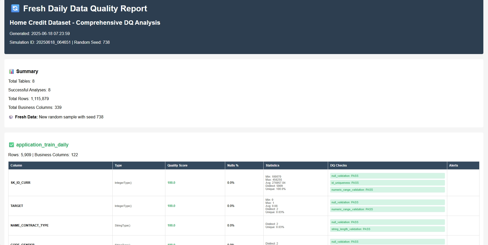

### JSON and TXT Summary Output

Structured and human-readable summaries are generated for programmatic and operational use:

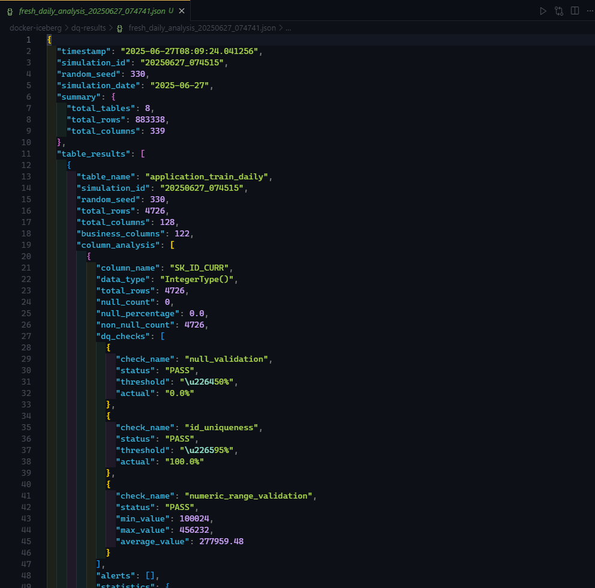
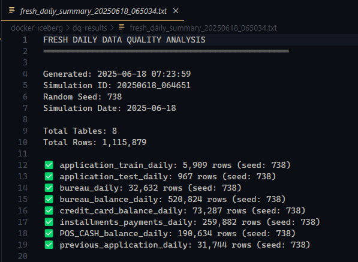

### Script Execution and Command Output

Running the daily simulation DQ script and exporting Parquet files:

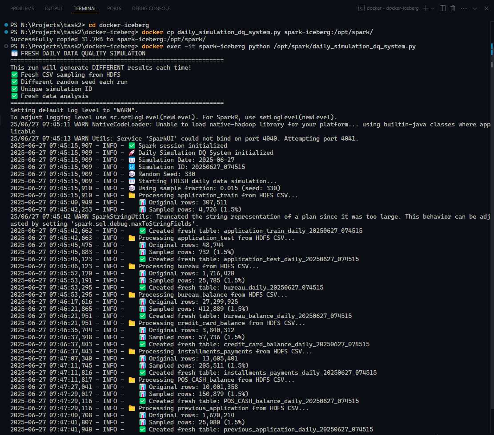
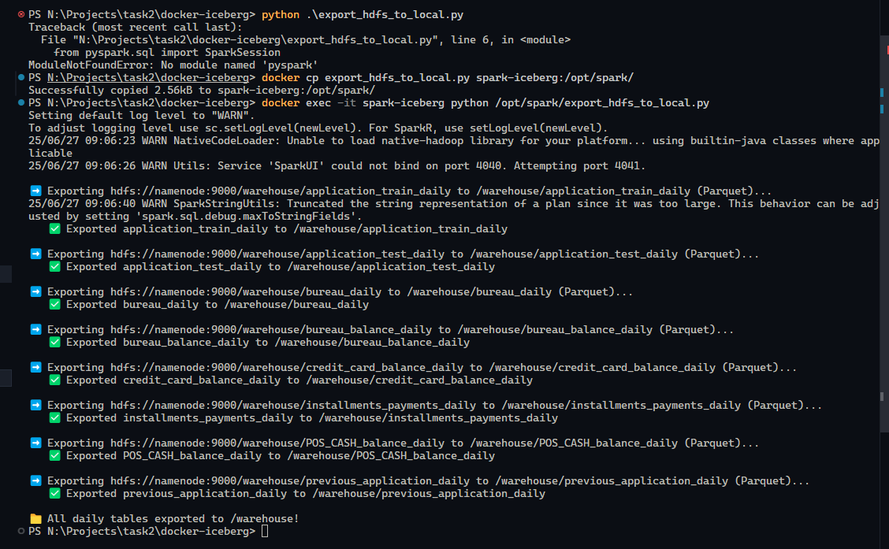

---

## Data Drift Detection

Automated drift detection between daily analysis files, with both JSON and HTML output:

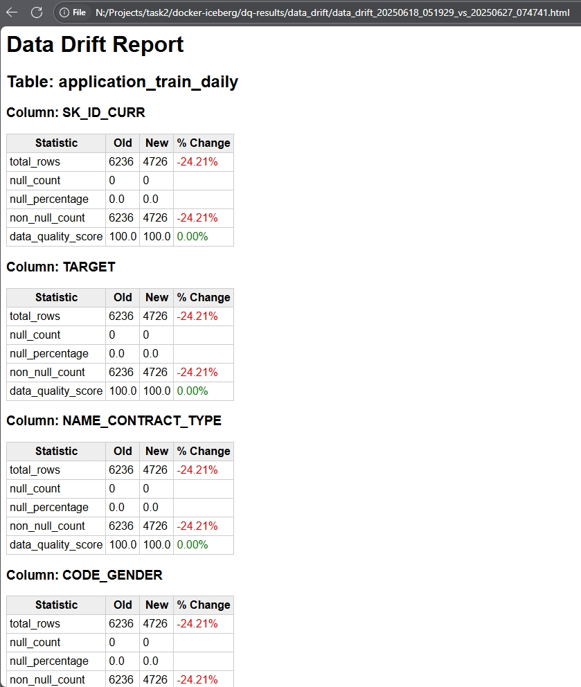
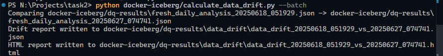

---

## DQOps Data Profiling & Monitoring

DQOps was used for automated data profiling, monitoring, and issue detection, but only in a manual way via Parquet export due to multiple technical complexities and integration limitations (not just Community Edition restrictions). Manual Parquet export enables profiling and monitoring in DQOps.

- Data profiling dashboard (column stats):
  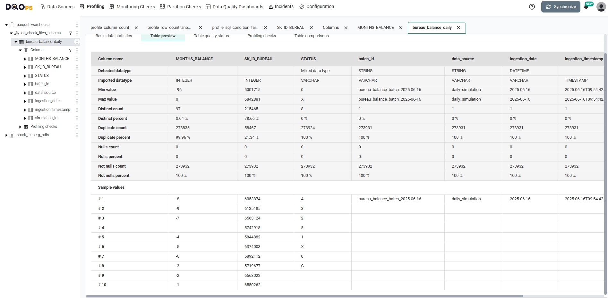
- Column-level profiling:
  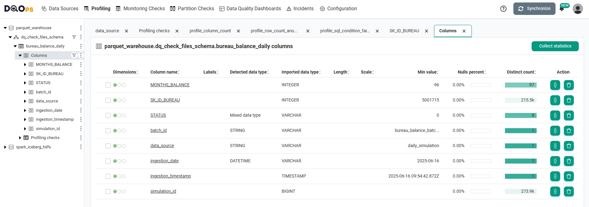
- Monthly balance profiling:
  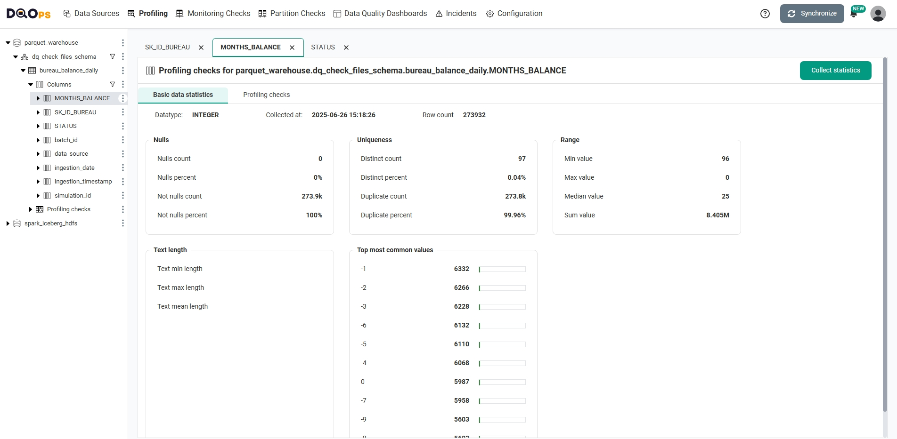
- Monitoring checks configuration:
  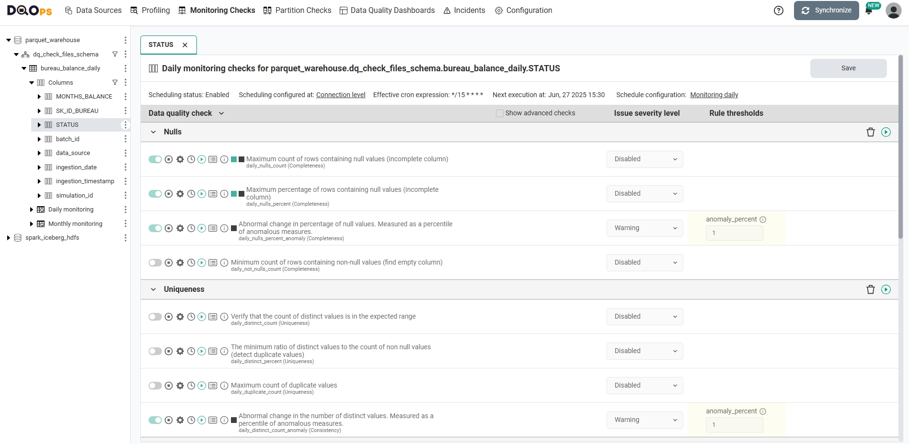
- Issue detection and dashboard:
  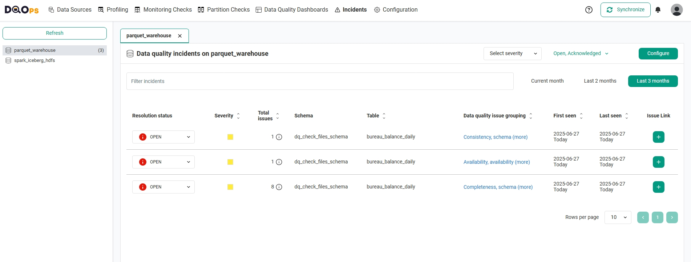
- DQOps dashboard unavailable due to integration and resource limitations:
  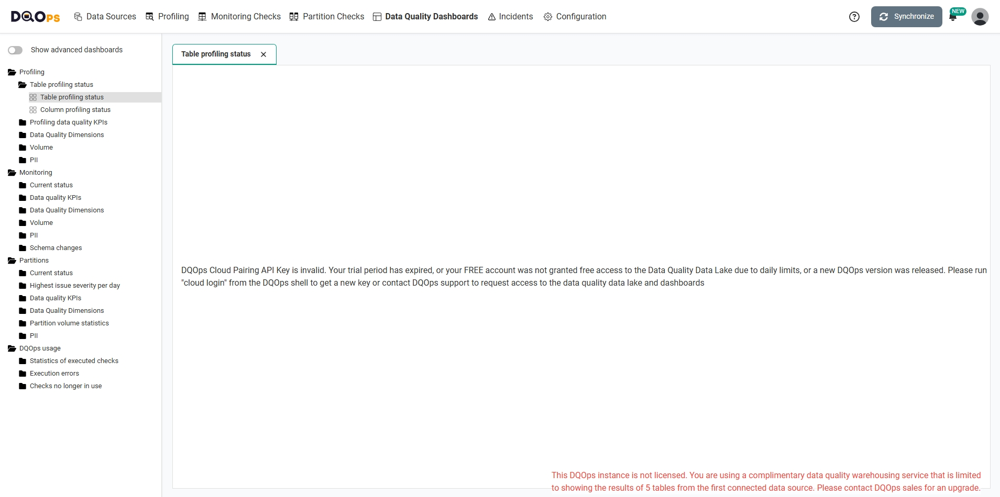

---

## OpenRefine Manual QA

OpenRefine was used for manual QA and inspection.

- Data import and profiling:
  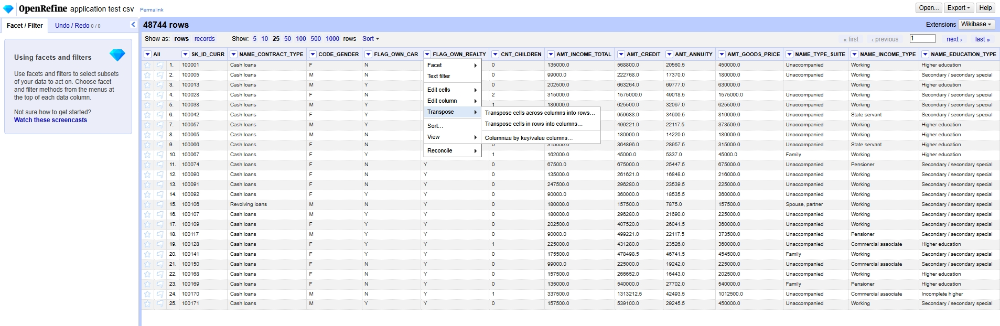
- OpenRefine becomes unresponsive when opening large data files:
  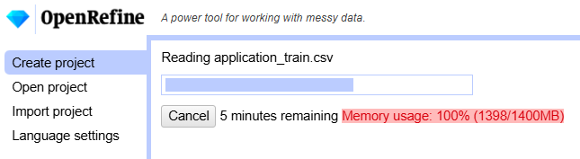

---

## Resource Usage

Monitoring memory usage when all docker containers are running on Windows:

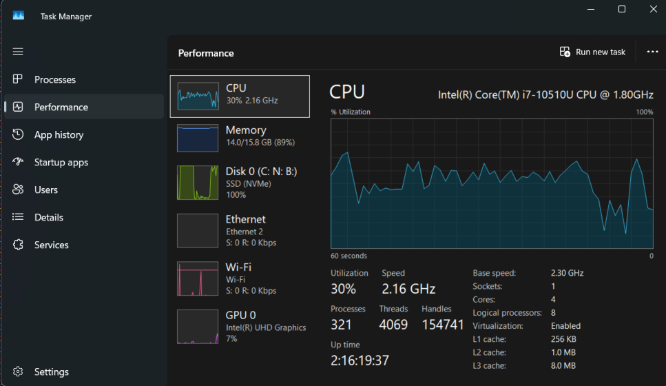

---

## How to Run

1. **Start Docker Environment:**
   ```bash
   cd docker-iceberg
   docker-compose up -d
   ```
2. **Run Data Quality Analysis:**
   ```bash
   docker cp daily_simulation_dq_system.py spark-iceberg:/opt/spark/
   docker exec -it spark-iceberg python /opt/spark/daily_simulation_dq_system.py
   ```
3. **Retrieve Reports:**
   ```bash
   docker cp spark-iceberg:/opt/spark/dq-results/. ./dq-results/
   # Open HTML reports in browser, use JSON/TXT as needed
   ```
4. **Export Parquet for DQOps / CSV Guide for OpenRefine:**
   ```bash
   # Run the manual integration demo script (PowerShell)
   cd docker-iceberg
   docker cp export_hdfs_to_local.py spark-iceberg:/opt/spark/
   docker exec -it spark-iceberg python /opt/spark/export_hdfs_to_local.py
   # This will copy Parquet exports (if present) and provide a guide for CSV export
   ```
5. **Run Data Drift Detection:**
   ```bash
   #from root directory
   python docker-iceberg/calculate_data_drift.py --batch
   ```

---

## Project Structure

```
n:\Projects\task2\
├── README.md
├── TASK_COMPLETION_FINAL.md
├── docker-iceberg/
│   ├── daily_simulation_dq_system.py
│   ├── calculate_data_drift.py
│   ├── docker-compose.yml
│   ├── dq-config.json
│   ├── README.md
│   ├── manual-integration-demo.ps1
│   ├── export_hdfs_to_local.py
│   ├── hdfs_iceberg_troubleshooting.ipynb
│   ├── dq-results/
│   │   ├── fresh_daily_dq_report_*.html
│   │   ├── fresh_daily_analysis_*.json
│   │   ├── fresh_daily_summary_*.txt
│   │   └── data_drift/
│   │       ├── data_drift_*.json
│   │       └── data_drift_*.html
│   ├── dq-results-final/
│   ├── dq-results-test/
│   ├── dq-results-fresh/
│   ├── notebooks/
│   ├── openrefine-workspace/
│   ├── dqops-home/
│   ├── archive/
│   └── warehouse/
├── docs/
│   ├── Screenshots/
│   └── TECHNICAL_DEEP_DIVE.md
├── Mind mapping/
│   ├── data_quality_analysis_engine.png
│   ├── dataset_description.png
│   ├── demonstration.png
│   ├── key_achievements.png
│   ├── reports_generated.png
│   ├── system_architecture.png
│   └── task_requirement.png
└── home-credit-default-risk-dataset/
    ├── application_train.csv
    ├── application_test.csv
    ├── bureau.csv
    ├── bureau_balance.csv
    ├── credit_card_balance.csv
    ├── installments_payments.csv
    ├── POS_CASH_balance.csv
    ├── previous_application.csv
    ├── sample_submission.csv
    ├── HomeCredit_columns_description.csv
    └── daily/
```

---

**For more technical details: [`docs/TECHNICAL_DEEP_DIVE.md`](docs/TECHNICAL_DEEP_DIVE.md)**
